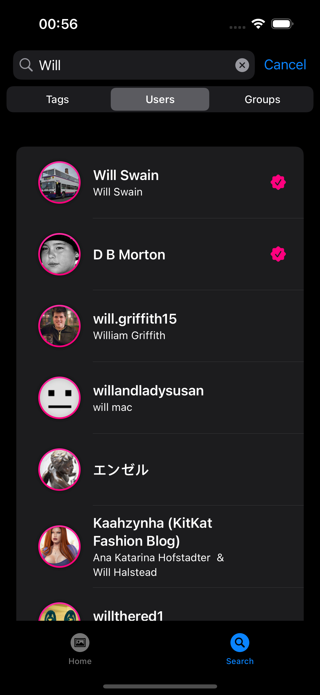

# Flickr

### This is an app for iOS using the Flickr API.

## Requirements

The app was developed on Xcode 15.0 and has a minimum target of iOS 17.0. 
The APIKeys.plist has the api_key needed to run the application, you can try to replace it but make sure your api_key has access to the method flickr.people.search, otherwise the app will work fully apart from the user search.

## Next Steps

- Fetch and display photo comments when the user is on the photo detail.
- Fetch and display discussions, photos, and members from the group on the group detail.
- Move base image URL and API base URL inside a config file.
- Add PhotosRequestSort on the photo search list.

## Architecture
It was decided to use MVVM, because the separation of concerns is clear, enabling better maintainability and testability.

## CI
There is a GitHub Action responsible for running the tests of the application, ensuring that no branches are failing. 🚀

## Screenshots
The app works in both dark mode and light mode, so feel free to use the one you prefer 📱.

|  |  |
| -------------------------------------------------- | -------------------------------------------------- |

I hope you enjoy it. 

